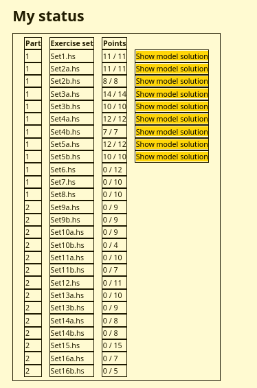

# Learning Haskell

Stores all the random code snippits 

Currently doing [haskell.mooc.fi](https://haskell.mooc.fi/)
I don't think it is a good idea to put the code openly on github so here is a photo of the progress.

